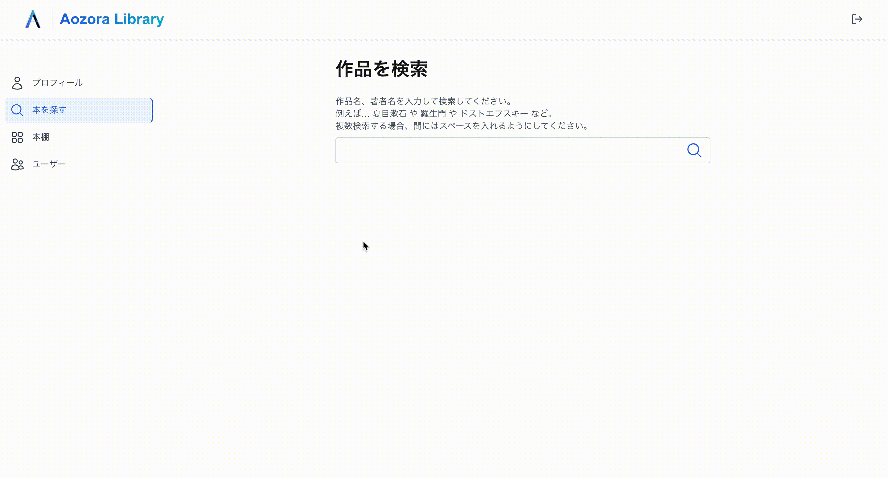
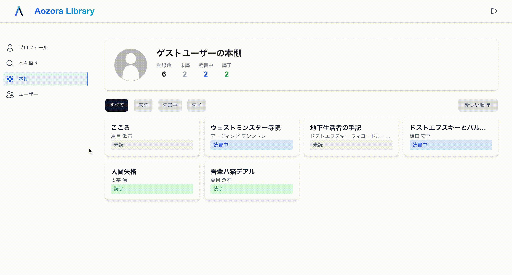

# Aozora Library

## 目次

- [サービス概要・制作背景](#サービス概要制作背景)
- [アプリケーションイメージ](#アプリケーションイメージ)
- [機能一覧](#機能一覧)
- [使用技術](#使用技術)
- [ER図](#er図)
- [インフラ構成図](#インフラ構成図)
- [工夫した点](#工夫した点)
- [苦労した点・技術的課題](#苦労した点技術的課題)
- [ローカル環境構築手順](#ローカル環境構築手順)

---

### 制作背景

青空文庫は、著作権の切れた文学作品を中心に無料で公開している電子図書館です。多くの人に長年利用されていますが、実際には「気になった作品を検索して読む」といった使い方が多いのではないかと感じました。

そこで、青空文庫の作品を継続的に読むことや、読んだ作品の記録・感想を残すことができるサービスを作ることで、青空文庫の作品をより楽しめる読書体験を提供したいと考え、このアプリケーションを制作しました。

### 差別化した点

一般的な読書記録サービスは幅広い書籍を対象としていますが、本サービスでは**青空文庫の作品に特化した読書記録サービス**として設計しました。

対象を青空文庫に限定することで、青空文庫の作品を読むユーザーが気軽に読書記録を残せるサービスを目指しました。

---

## アプリケーションイメージ

アカウント作成/ログイン後の、本の登録から読書・感想の記録までの流れを紹介します。

### STEP 1. 本を検索して本棚に登録する

タイトルまたは著者名で検索し、読みたい本のステータス（未読・読書中・読了）を選択して本棚に追加します。

### STEP 2. 本棚を管理しながら読む

本棚に追加した本をリーダーで読むことができます。フォントサイズやテーマを好みに合わせて調整しながら読み進めます。

### STEP 3. 感想・評価を記録する

読了後は本棚から星評価と感想テキストを記録します。

---

## 機能一覧

### ユーザー機能

| 機能 | 説明 |
| --- | --- |
| 新規会員登録 | メールアドレスとパスワードで登録できる |
| ログイン・ログアウト | 登録済みアカウントでログインできる |
| ゲストログイン | アカウント登録なしでサービスを体験できる |
| プロフィール表示 | アップロードしたプロフィール画像・名前・読書統計を確認できる |
| プロフィール編集 | 名前とプロフィール画像を変更できる |
| ユーザー一覧 | 他のユーザーのプロフィールと本棚を閲覧できる |

### 本検索機能

| 機能 | 説明 |
| --- | --- |
| キーワード検索 | タイトルまたは著者名で青空文庫の作品を検索できる |
| 複数キーワード検索 | スペース区切りで複数のキーワードを指定して検索できる |
| ページネーション | 検索結果を12件ずつページ表示する |
| 本棚への追加 | 検索結果から本棚にステータスを選択して登録できる |

### 読書機能

| 機能 | 説明 |
| --- | --- |
| 本棚管理 | 本を「未読・読書中・読了」のステータスで管理できる |
| リーダー | 青空文庫の本文をアプリ内で読むことができる |
| フォントサイズ変更 | リーダーのフォントサイズを小・中・大から選択できる |
| テーマ切り替え | リーダーの表示テーマをライト・ダークから選択できる |
| 評価 | 読んだ本に1〜5の星評価をつけられる |
| レビュー記録 | 読んだ本の感想をテキストで記録できる |
| 読書統計 | 未読・読書中・読了の内訳をドーナツグラフで確認できる |

---

## 使用技術

| フロントエンド |
| --- |
| React 18 |
| Next.js 14.2.30 |
| TypeScript 5.3.3 |
| Axios(バックエンドとの非同期通信) |
| TanStack Query(データフェッチ・キャッシュ管理) |
| React Hook Form(フォーム管理) |
| Zustand(状態管理) |
| Tailwind CSS |
| Recharts(グラフ描画) |
| ESLint / Prettier(静的解析、フォーマッター) |

| バックエンド |
| --- |
| Ruby 3.2.2 |
| Ruby on Rails 7.2.2.1 |
| MySQL 8.0.36 |
| Puma(AP サーバー) |
| Nginx(Web サーバー) |
| RuboCop(静的解析、フォーマッター) |
| RSpec(自動テスト) |

| インフラ |
| --- |
| Docker / Docker Compose |
| AWS（ECS on Fargate, ECR, RDS, ElastiCache, CloudFront, Route53, VPC, ACM） |
| Vercel(フロントエンドホスティング) |
| GitHub Actions(CI/CDパイプラインの構築) |

---

## ER図

---

## インフラ構成図

---

## 工夫した点

### フロントエンド

### バックエンド

### インフラ

---

## 苦労した点・技術的課題

### フロントエンド

### バックエンド

### インフラ

---

## ローカル環境構築手順
