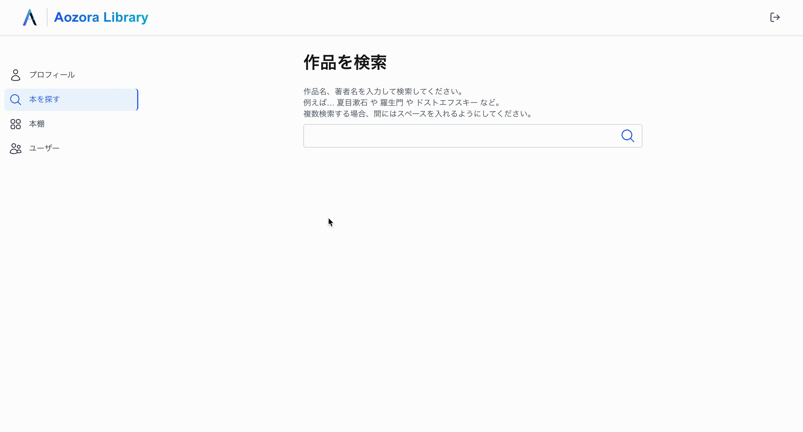
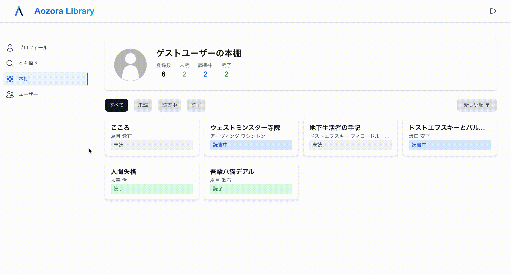
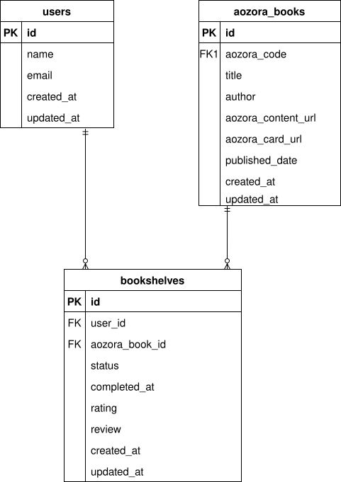
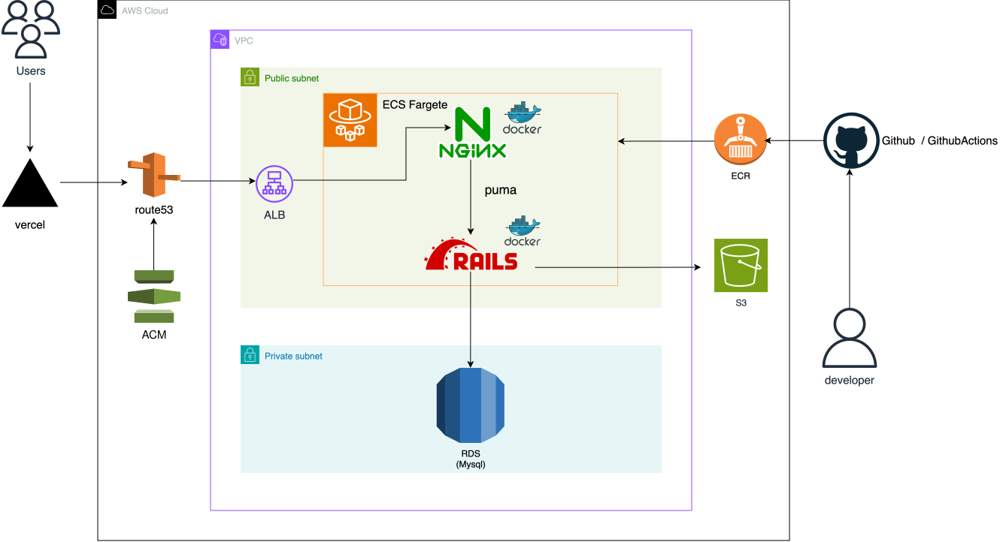

# Aozora Library
 
**アプリケーションURL: https://aozora-library.com**
(現在停止中)

## 目次

- [サービス概要](#サービス概要)
- [アプリケーションイメージ](#アプリケーションイメージ)
- [機能一覧](#機能一覧)
- [使用技術](#使用技術)
- [ER図](#er図)
- [インフラ構成図](#インフラ構成図)
- [工夫した点](#工夫した点)
- [苦労した点・技術的課題](#苦労した点技術的課題)

---

## サービス概要

青空文庫の作品を検索し、本棚管理・読書・感想記録ができる読書管理サービスです。

### 制作背景

読書管理アプリを使う中で、本棚に読了作品が積み重なる達成感や「次に読む本リスト」が読書継続のモチベーションになることを実感していました。

一方、青空文庫は安定した需要を持つサービスでありながら、継続的な読書体験を促す仕組みがありませんでした。

このギャップを埋めるため、**「青空文庫の作品をアプリ内で読み、そのまま本棚に記録できる」** Web アプリを開発しました。

### 差別化

一般的な読書記録サービスは幅広い書籍を対象としていますが、本サービスでは**青空文庫作品に特化した読書管理サービス**として設計しました。

---

## アプリケーションイメージ

アカウント作成/ログイン後の、本の登録から読書・感想の記録までの流れを紹介します。

### STEP 1. 本を検索して本棚に登録する

タイトルまたは著者名で検索し、読みたい本のステータス（未読・読書中・読了）を選択して本棚に追加します。

### STEP 2. 本棚を管理しながら読む

本棚に追加した本をリーダーで読むことができます。フォントサイズやテーマを好みに合わせて調整しながら読み進めます。

### STEP 3. 感想・評価を記録する

読了後は本棚から星評価と感想テキストを記録します。

---

## 機能一覧

### ユーザー機能

| 機能 | 説明 |
| --- | --- |
| 新規会員登録 | メールアドレスとパスワードで登録できる |
| ログイン・ログアウト | 登録済みアカウントでログインできる |
| ゲストログイン | アカウント登録なしでサービスを体験できる |
| プロフィール表示 | アップロードしたプロフィール画像・名前・読書統計を確認できる |
| プロフィール編集 | 名前とプロフィール画像を変更できる |
| ユーザー一覧 | 他のユーザーのプロフィールと本棚を閲覧できる |

### 本検索機能

| 機能 | 説明 |
| --- | --- |
| キーワード検索 | タイトルまたは著者名で青空文庫の作品を検索できる |
| 複数キーワード検索 | スペース区切りで複数のキーワードを指定して検索できる |
| ページネーション | 検索結果を12件ずつページ表示する |
| 本棚への追加 | 検索結果から本棚にステータスを選択して登録できる |

### 読書機能

| 機能 | 説明 |
| --- | --- |
| 本棚管理 | 本を「未読・読書中・読了」のステータスで管理できる |
| ソート | 本棚追加日で新しい順・古い順にソートできる |
| フィルター | 読書状況（未読・読書中・読了）でフィルタリングできる |
| リーダー | 青空文庫の本文をアプリ内で読むことができる |
| フォントサイズ変更 | リーダーのフォントサイズを小・中・大から選択できる |
| テーマ切り替え | リーダーの表示テーマをライト・ダークから選択できる |
| 評価 | 読んだ本に1〜5の星評価をつけられる |
| レビュー記録 | 読んだ本の感想をテキストで記録できる |
| 読書統計 | 未読・読書中・読了の内訳をドーナツグラフで確認できる |

---

## 使用技術

| フロントエンド |
| --- |
| React 18 |
| Next.js 14.2.30 |
| TypeScript 5.3.3 |
| Axios(バックエンドとの非同期通信) |
| TanStack Query(データフェッチ・キャッシュ管理) |
| React Hook Form(フォーム管理) |
| Zustand(状態管理) |
| Tailwind CSS |
| Recharts(グラフ描画) |
| ESLint / Prettier(静的解析、フォーマッター) |

| バックエンド |
| --- |
| Ruby 3.2.2 |
| Ruby on Rails 7.2.2.1 |
| MySQL 8.0.36 |
| Puma(AP サーバー) |
| Nginx(Web サーバー) |
| RuboCop(静的解析、フォーマッター) |
| RSpec(自動テスト) |

| インフラ |
| --- |
| Docker / Docker Compose |
| AWS（ECS on Fargate, ECR, RDS, CloudFront, Route53, VPC, ACM） |
| Vercel(フロントエンドホスティング) |
| GitHub Actions(CI/CDパイプラインの構築) |

---

## ER図

---

## インフラ構成図

---

## 工夫した点

### フロントエンド

- **URLパラメータベースのページネーション**
  - 検索キーワードとページ番号をURLクエリパラメータで管理し、ページリロードやブラウザバック後も検索状態が保持されるようにしました。

- **本棚詳細のモーダル表示**
  - 本棚ページで登録済みの作品カードをクリックするとモーダルを表示し、ステータス変更・星評価・レビュー記入・リーダーへの遷移などの操作を一画面で完結できるようにしました。

- **閲覧ユーザーに応じたUI制御**
  - 他のユーザーのページを閲覧する際はレビュー編集用のモーダルを非表示にし、自分のページでのみ編集操作が行える設計にしました。ログイン中のユーザーIDと表示対象のユーザーIDを比較することで制御しています。

- **アクション別のトースト通知**
  - 本棚への追加・ステータス変更・レビュー保存・削除など、操作の種類ごとにトーストのメッセージを出し分け、ユーザーが行った操作を直感的にフィードバックできるようにしました。

- **リーダー画面のカスタマイズ機能**
  - 作品を読むリーダー画面では、フォントサイズ（小・中・大）の変更とダークモードの切り替えを実装し、ユーザーが読書環境を好みに合わせて調整できるようにしました。

### バックエンド

- **RakeタスクによるCSV一括インポート**
  - 青空文庫の全作品データ約18,000件をCSVからDBに取り込むRakeタスクを実装しました。

- **複数キーワードのAND検索・表記ゆれ対応**
  - スペース・全角スペースで区切られた複数キーワードを全て満たすレコードのみ抽出するAND検索を実装しました。また、青空文庫のデータにはタイトルや著者名にスペースが入っているものと入っていないものが混在しているため、検索時にスペースを除去して比較することで表記ゆれに対応しました。

- **includes によるN+1問題の対策**
  - 本棚一覧取得時に`includes(:aozora_book)`で関連データを一括取得し、N+1クエリを防止しました。

### インフラ

- **バックエンドをAWS、フロントエンドをVercelで分離構成**
  - バックエンド（Ruby on Rails + Nginx）は Amazon ECS（Fargate）で稼働し、DBには Amazon RDS、ファイル保存には Amazon S3 を使用しています。
  - フロントエンドはNext.jsと相性の良いVercelにデプロイしました。

- **GitHub Actions によるCI/CDパイプラインの構築**
  - プッシュ・プルリクエスト時にRuboCopによる静的解析とRSpecによる自動テストを実行しました。

